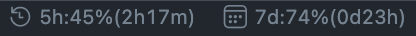

# Claude Usage Monitor for VS Code

VS Code のステータスバーに Claude Pro プランの使用制限をリアルタイム表示する拡張機能です。



## 表示例

```
🕐 5h:41%(2h33m)  📅 7d:73%(0d23h)
```

- **5h** — 現在のセッション（5時間枠）の使用率とリセットまでの時間
- **7d** — 週間制限（7日間）の使用率とリセットまでの時間
- 使用率が **80% を超える**と警告アイコン ⚠️ に切り替わります
- ステータスバーを **クリックで即時更新**、デフォルト **5分ごとに自動更新**

## 仕組み

claude.ai のブラウザ内部 API (`/api/organizations/{orgId}/usage`) からデータを取得しています。Cloudflare の TLS フィンガープリント検査を突破するために、Python の [curl_cffi](https://github.com/lexiforest/curl_cffi) を使用しています。

```
VS Code 拡張 (JS) → Python スクリプト (curl_cffi) → claude.ai 内部 API
```

## 前提条件

- **VS Code** 1.80 以上
- **Python** 3.9 以上（`curl_cffi` がインストールされた環境）
- **Claude Pro** プランの契約

## インストール

### 1. curl_cffi をインストール

```bash
pip install curl_cffi
```

### 2. 拡張機能をインストール

```bash
# リポジトリをクローン
git clone https://github.com/tigtie09/claude-usage-monitor.git

# VS Code の拡張ディレクトリにコピー
cp -r claude-usage-monitor ~/.vscode/extensions/claude-usage-monitor
```

### 3. VS Code を再起動

`Cmd+Shift+P`（macOS）/ `Ctrl+Shift+P`（Windows/Linux）→ `Reload Window`

### 4. 初期設定

#### Cookie の取得方法

1. ブラウザで [claude.ai](https://claude.ai) にログイン
2. DevTools を開く（`F12`）
3. **Application** タブ → **Cookies** → `https://claude.ai`
4. `sessionKey` の値をコピー

#### Organization ID の取得方法

1. DevTools → **Network** タブを開く
2. claude.ai で任意のページをリロード
3. リクエスト URL に含まれる `/organizations/xxxxxxxx-xxxx-xxxx-xxxx-xxxxxxxxxxxx/` の部分が Organization ID

#### 設定

`Cmd+Shift+P` → `Claude Usage: 初期設定` を実行して、対話的に入力できます。

または、`settings.json` に直接記述：

```jsonc
{
    "claudeUsage.orgId": "your-org-id-here",
    "claudeUsage.sessionKey": "sk-ant-sid02-...",

    // オプション
    "claudeUsage.pythonPath": "python",           // Python のパス（デフォルト: python）
    "claudeUsage.refreshIntervalMinutes": 5        // 更新間隔（デフォルト: 5分）
}
```

## 設定一覧

| 設定名 | 必須 | デフォルト | 説明 |
|--------|------|-----------|------|
| `claudeUsage.orgId` | ✅ | — | Organization ID |
| `claudeUsage.sessionKey` | ✅ | — | sessionKey Cookie |
| `claudeUsage.cfClearance` | — | — | cf_clearance Cookie（通常は不要） |
| `claudeUsage.pythonPath` | — | `python` | curl_cffi がインストールされた Python のパス |
| `claudeUsage.refreshIntervalMinutes` | — | `5` | 自動更新の間隔（分） |

## トラブルシューティング

### ステータスバーに「Claude: エラー」と表示される

- `python` コマンドで `curl_cffi` がインポートできるか確認：
  ```bash
  python -c "from curl_cffi import requests; print('OK')"
  ```
- conda 等の仮想環境を使っている場合は `claudeUsage.pythonPath` にフルパスを指定：
  ```json
  "claudeUsage.pythonPath": "/Users/yourname/opt/anaconda3/bin/python"
  ```

### ステータスバーに「Claude: HTTP 403」と表示される

- `sessionKey` が期限切れの可能性があります。ブラウザの DevTools から新しい値を取得してください
- それでも解決しない場合は `cf_clearance` Cookie も設定してみてください

### sessionKey の有効期限

`sessionKey` の有効期限は約1ヶ月です。期限切れになったらブラウザから再取得してください。

## ⚠️ 注意事項

- **非公式 API を使用しています。** Anthropic が API を変更した場合、動作しなくなる可能性があります
- **認証情報の取り扱いに注意してください。** `sessionKey` は `settings.json` に平文で保存されます。リポジトリに `settings.json` をコミットしないでください
- **利用は自己責任です。** この拡張機能の使用によって生じたいかなる問題についても、開発者は責任を負いません

## ファイル構成

```
claude-usage-monitor/
├── extension.js      # VS Code 拡張本体
├── fetch_usage.py    # Python による API 取得スクリプト
├── package.json      # 拡張の設定・メタデータ
├── README.md
├── LICENSE
└── .gitignore
```

## API レスポンス例

```json
{
    "five_hour": {
        "utilization": 41.0,
        "resets_at": "2026-03-13T11:00:00.327478+00:00"
    },
    "seven_day": {
        "utilization": 73.0,
        "resets_at": "2026-03-14T08:00:00.327501+00:00"
    }
}
```

## 開発の経緯

Claude Pro プランには5時間のセッション制限と7日間の週間制限がありますが、使用状況を確認するにはブラウザで claude.ai を開く必要があります。VS Code でコーディング中にサッと確認できるようにしたいという動機で開発しました。

Cloudflare の bot 対策を突破するために以下のアプローチを試行錯誤しました：

1. ❌ `requests` + `sessionKey` → Cloudflare に弾かれる
2. ❌ Node.js `https` モジュール → TLS フィンガープリントが異なるため弾かれる
3. ❌ `curl` コマンド → macOS の curl でも弾かれる
4. ✅ `curl_cffi`（Python）→ Chrome の TLS フィンガープリントを模倣して突破

## ライセンス

MIT License
